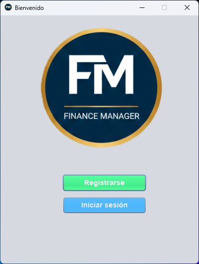
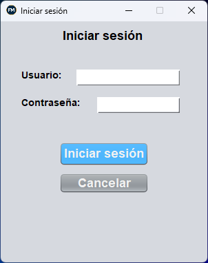
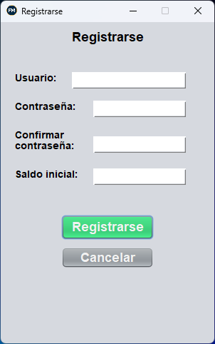
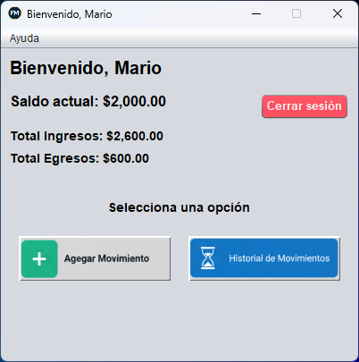
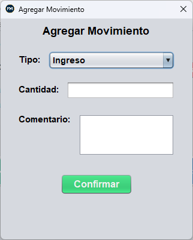
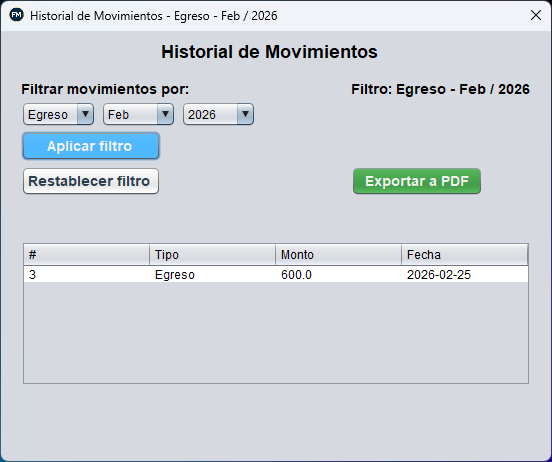
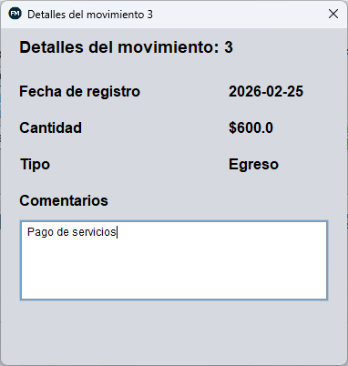
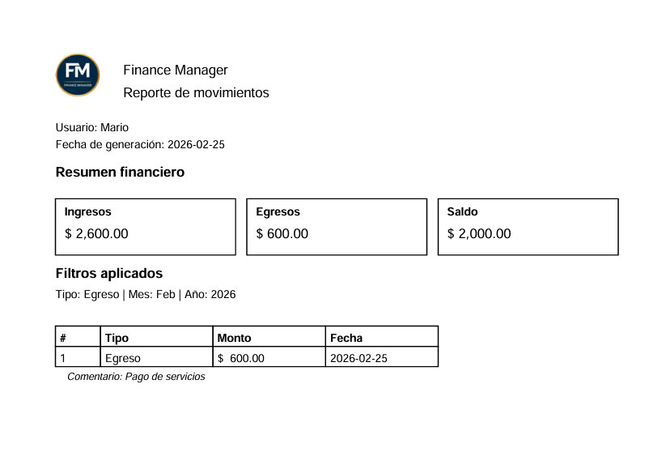

#  Finance Manager

Aplicación de escritorio desarrollada en Java para la gestión simple de finanzas personales.  
Permite registrar ingresos y egresos, calcular saldo dinámico, aplicar filtros por fecha y exportar reportes en PDF.

---

##  Descripción

**Finance Manager** es una aplicación orientada a la administración básica de finanzas personales.  
El sistema permite a los usuarios registrarse, iniciar sesión y llevar un control detallado de sus movimientos financieros mediante una base de datos local MySQL.

El proyecto fue desarrollado siguiendo prácticas como:

- Separación entre lógica de negocio e interfaz gráfica
- Uso de transacciones
- Manejo de excepciones
- Encriptación de contraseñas
- Prevención de SQL Injection
- Generación profesional de reportes PDF

---

##  Funcionalidades

###  Gestión de usuarios
- Registro con validación de datos
- Contraseñas encriptadas con SHA-256 + SALT
- Validación de usuario duplicado
- Inicio de sesión seguro

###  Gestión financiera
- Registro de ingresos y egresos
- Cálculo automático del saldo actual
- Cálculo total de ingresos
- Cálculo total de egresos
- Saldo calculado dinámicamente desde la base de datos

###  Filtros
- Filtrado por tipo (Ingreso / Egreso)
- Filtrado por mes
- Filtrado por año

###  Reportes
- Exportación de historial en PDF
- Resumen financiero incluido
- Filtros aplicados visibles en el reporte
- Paginación automática
- Comentarios por movimiento

---

##  Tecnologías utilizadas

- **Java SE**
- **Swing (Interfaz gráfica)**
- **MySQL (Base de datos local)**
- **JDBC**
- **Apache PDFBox (Generación de PDF)**

---

##  Arquitectura del proyecto

El proyecto está dividido en dos capas principales:

###  `clases`
Contiene la lógica de negocio y acceso a datos:

- `Conexion` → Conexión a MySQL
- `Seguridad` → Hash SHA-256 para contraseñas
- `Usuarios` → Registro y autenticación
- `Movimientos` → Gestión de ingresos y egresos
- `Movimiento` → Modelo de datos
- `ReportePDF` → Generación de reportes

###  `ventanas`
Contiene la interfaz gráfica (Swing):

- `Inicio`
- `Registrarse`
- `Login`
- `Principal`
- `HistorialMovimientos`
- Otras ventanas auxiliares

---

##  Seguridad

- Las contraseñas **no se almacenan en texto plano**
- Se utiliza **SHA-256 + SALT**
- Uso de `PreparedStatement` para prevenir SQL Injection
- Eliminación de contraseña de memoria después de su uso
- Transacciones para mantener integridad en el registro

---

##  Base de Datos

El proyecto incluye un script SQL para crear la base de datos:

### 📁 `bd_fm.sql`

Contiene:

- Creación de la base de datos
- Tablas `usuarios` y `movimientos`
- Llaves primarias
- Llaves foráneas
- Restricciones `UNIQUE`
- Tipos de datos adecuados

### Modelo relacional

- Un usuario puede tener múltiples movimientos
- El saldo no se almacena, se calcula dinámicamente

---

##  Instalación y ejecución

### 1️⃣ Clonar el repositorio

```bash
git clone https://github.com/Mario-zs/FinanceManager.git
```
---

### 2️⃣ Crear la base de datos

Ejecutar el archivo:

```sql
bd_fm.sql
```
en MySQL para crear la base de datos y sus tablas.

---

### 3️⃣ Configurar conexión

Verificar los datos de conexión en la clase Conexion.java:

```Java
private static final String URL = "jdbc:mysql://localhost/bd_fm?serverTimezone=UTC";
private static final String USER = "root";
private static final String PASSWORD = "";
```

Modificar si tu configuración local es diferente.

---

### 4️⃣ Ejecutar la aplicación

- Abrir el proyecto en NetBeans o IntelliJ IDEA
- Ejecutar la clase principal:
```Java
Inicio.java
```

---

##  Capturas de pantalla

###  Pantalla de Inicio


---

### Iniciar sesión


---

### Registrarse


---

###  Panel Principal


---

###  Agregar Movimiento


---

###  Historial de Movimientos


---

###  Detalles movimiento


---

###  Reporte PDF



---

##  Licencia

### MIT License
Puedes usar, modificar y distribuir este código siempre que incluyas la nota de copyright y licencia.
Desarrollado por Mario Alberto Melgarejo Villaseñor © 2026
¡Gracias por usar Finance Manager!